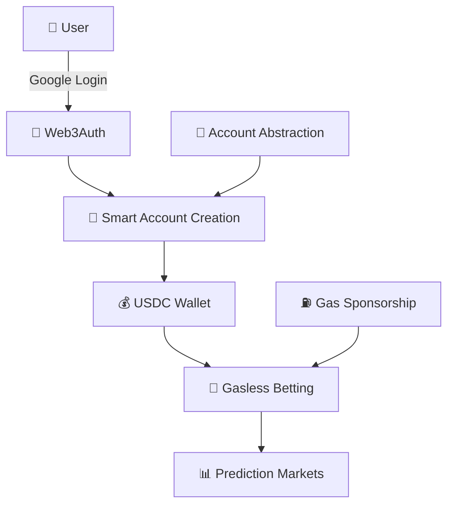

# 🎯 AAPM - Account Abstraction for Prediction Markets

> **Making prediction markets feel like normal apps, not DeFi dApps**

## 🌟 Project Vision

AAPM transforms the prediction market experience by eliminating the complexity of traditional Web3 interactions. Our goal is to make betting on future events as simple as using any mainstream application.

## 🚀 The Problem We Solve

**Traditional prediction markets feel like DeFi dApps:**
- ❌ Complex wallet setup and management
- ❌ Confusing bridging between networks  
- ❌ Gas fees for every transaction
- ❌ Technical barriers for mainstream users

**AAPM makes it feel like a normal app:**
- ✅ **Social Login**: Sign in with Google - no wallet needed
- ✅ **Smart Accounts**: Automatically created for each user
- ✅ **Gasless Experience**: Only pay with USDC for betting, no gas fees
- ✅ **Seamless UX**: No technical knowledge required

## 🏗️ System Design



### Key Components:
- **🔐 Social Authentication**: Web3Auth integration for familiar login experience
- **🏦 Smart Accounts**: Account abstraction eliminates EOA wallet complexity
- **⛽ Gasless Transactions**: Gas sponsorship removes transaction friction
- **💰 USDC-Only**: Simple token-based betting without native BNB requirements
- **📱 Mobile-First UI**: Responsive design that works everywhere

## ⚡ Quick Start

### 🚀 One-Command Setup
```bash
# Clone and install everything
git clone https://github.com/arifintahu/aapm.git
cd aapm
npm run install:all
```

### 🏃‍♂️ Run the Application
```bash
# Start everything (frontend + backend + blockchain)
npm run dev
```

**That's it! 🎉**
- 🌐 Frontend: http://localhost:5173
- 🔧 Backend API: http://localhost:3000  
- ⛓️ Local Blockchain: http://localhost:8545

### 🎮 Try It Out
1. Open http://localhost:5173
2. Click "Login with Google"
3. Start betting with USDC (no gas needed!)

## 🛠️ For Developers

<details>
<summary>📁 Project Structure</summary>

```
aapm/
├── 📱 frontend/          # React app with gasless UX
├── 🔧 backend/           # Express API server  
├── 📜 contracts/         # Smart contracts & deployment
└── 📚 docs/              # Documentation
```
</details>

<details>
<summary>🔧 Development Commands</summary>

```bash
# Individual services
npm run dev:frontend     # React app only
npm run dev:backend      # API server only  
npm run dev:contracts    # Local blockchain only

# Testing & Building
npm run test:contracts   # Run smart contract tests
npm run build:all        # Build for production
npm run lint:frontend    # Code quality checks
```
</details>

<details>
<summary>⚙️ Environment Setup</summary>

Create `.env` files in each directory:

**Frontend:**
```env
VITE_WEB3AUTH_CLIENT_ID=your_web3auth_client_id
VITE_CHAIN_ID=0x61
VITE_CHAIN_RPC_URL=https://data-seed-prebsc-1-s1.binance.org:8545
VITE_CHAIN_NETWORK_NAME=BSC Testnet
VITE_CHAIN_BLOCK_EXPLORER_URL=https://testnet.bscscan.com
VITE_CHAIN_TICKER=BNB
VITE_CHAIN_TICKER_NAME=Binance Coin
VITE_CHAIN_LOGO_URL=https://cryptologos.cc/logos/bnb-bnb-logo.png
VITE_PREDICTION_MARKET_ADDRESS=your_deployed_contract_address
VITE_MOCK_USDC_ADDRESS=your_deployed_usdc_address
VITE_BACKEND_URL=http://localhost:4000
```

**Backend:**
```env
# Database Configuration
DB_HOST=localhost
DB_PORT=5432
DB_NAME=aapm_db
DB_USER=aapm_user
DB_PASSWORD=aapm_password
DB_SSL=false
DB_MAX_CONNECTIONS=20
DB_IDLE_TIMEOUT=30000
DB_CONNECTION_TIMEOUT=2000

# Server Configuration
PORT=4000
NODE_ENV=development
JWT_SECRET=your_jwt_secret_key
CORS_ORIGINS=https://yourdomain.com,https://app.yourdomain.com

# Gasless Transaction Configuration
GASLESS_FACTORY_ADDRESS=your_factory_address
GASLESS_GAS_PAYER_PRIVATE_KEY=your_gas_payer_private_key
GASLESS_CHAIN_ID=97

# Contract Configuration
PREDICTION_MARKET_ADDRESS=your_deployed_contract_address
PRIVATE_KEY=your_deployer_private_key
RPC_URL=https://data-seed-prebsc-1-s1.binance.org:8545


```

**Contracts:**
```env
# Deployment Configuration
PRIVATE_KEY=your_deployer_private_key
RPC_URL=https://data-seed-prebsc-1-s1.binance.org:8545
CHAIN_ID=97

# Contract Addresses (after deployment)
PREDICTION_MARKET_ADDRESS=your_deployed_contract_address
MOCK_USDC_ADDRESS=your_deployed_usdc_address
```
</details>

## 📄 License

This project is licensed under the MIT License - see the [LICENSE](LICENSE) file for details.
